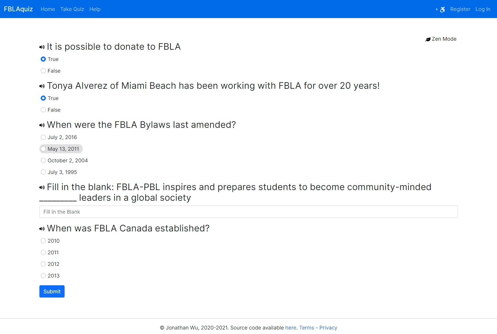

# What is FBLAquiz?

FBLAquiz is a web application serving quizzes about everything FBLA! It comes with all the tools 
you need to create problems, run quizzes, and manage users.

## Live Demo
https://fblaquiz.live

The demo is reset every hour. 
Admin account credentials: `admin:FBLAadmin` 
User account credentials: `user:FBLAuser` 
Alternatively, you may create your own account.

## Features
### Easy Installation
Although running FBLAquiz on a modern Linux distro is recommended, it runs on any modern version of
Windows, MacOS, and Linux. The only requirements are Python 3, and access to an administrator 
(root) account. More details can be found in [INSTALL.md](docs/INSTALL.md). The actual installation 
process is also very short and simple, taking at most 15 minutes, even on a slow office computer.

### Comprehensive Admin Tools
Admins of a site get access to a multitude of tools, including the ability to ban users or remotely 
reset passwords. Admins also get statistics on problems, such as the solve rate and number of 
submissions. As well, problems can be created, edited, and deleted at any time. All of these 
features can be accessed through the web interface. For more advanced admins, interacting with the 
database using sqlite3 is also possible, but not recommended.

### Fast and Lightweight
Users can get quiz results instantly after they submit. Fast and data-efficient, even on 3G 
connections.

### Personalized
Users can get personalized tips to help them perform better. By creating an account, users can save 
and view past quiz results, get access to detailed statistics, and get personalized training.

### Private and Secure
We take data security very seriously. We do not collect any data about you, the sysadmin, or any 
users. All data that users send to the site, including passwords and other form data are encrypted 
with industry-grade encryption. We also do not sell your data, and more information about how we 
handle user data is available in the Privacy Policy.

### Zen Mode
Distracted by the navigation bar and scroll bar? You can hide them with the Zen Mode while taking a 
test.

### More Features
- Accessibility settings
- Google sign-in integration
- User management
- Submission management
- Basic profile & statistics
- 2 factor authentication
- And more!

## Problem Types
As part of a quiz, users can see any of the following problem types:
### Multiple Choice
Users will have to select the best choice out of 4 options.

### Multiple Select
Users will have to select all of the correct answers, which could range from none of the choices to 
all of the choices.

### Fill in the Blank
Given a sentence or a prompt, users will have to fill in the blank or otherwise answer the question 
by typing in the answer.

### True or False
Users will be presented with a statement and have to decide if it is true or false.

### Dropdown
Users will have to select the most relevant answer from a dropdown list.

## Installation and Quickstart
See [INSTALL.md](docs/INSTALL.md).

## License
This project is licensed under the [GNU AGPLv3](LICENSE).

## Dependencies
- [cs50 6.0.4](https://cs50.readthedocs.io/libraries/cs50/python/)
- [Flask 2.0.1](https://flask.palletsprojects.com/en/2.0.x/)
- [Flask-Mail 0.9.1](https://pythonhosted.org/Flask-Mail/)
- [Flask-Session 0.3.2](https://flask-session.readthedocs.io/en/latest/)
- [Flask-WTF 0.15.1](https://flask-wtf.readthedocs.io/en/0.15.x/)
- [PyJWT 2.1.0](https://pyjwt.readthedocs.io/en/latest/)
- [Google API for Python](https://cloud.google.com/apis/docs/client-libraries-explained#google_api_client_libraries)
- [Requests 2.25.1](https://docs.python-requests.org/en/master/)
- [Bootstrap 5.0.0](https://getbootstrap.com/)
- [jQuery 3.5.1](https://jquery.com/)
